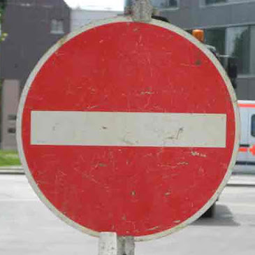

# **Traffic Sign Recognition**

## Writeup

### You can use this file as a template for your writeup if you want to submit it as a markdown file, but feel free to use some other method and submit a pdf if you prefer.

---

**Build a Traffic Sign Recognition Project**

The goals / steps of this project are the following:
* Load the data set (see below for links to the project data set)
* Explore, summarize and visualize the data set
* Design, train and test a model architecture
* Use the model to make predictions on new images
* Analyze the softmax probabilities of the new images
* Summarize the results with a written report

[//]: # (Image References)

[example_image]: ./images/example_image.png
[distribution1]: ./images/label_distribution.png
[before]: ./images/before.png
[after]: ./images/after.png

## Rubric Points
### Here I will consider the [rubric points](https://review.udacity.com/#!/rubrics/481/view) individually and describe how I addressed each point in my implementation.  

---
### Writeup / README

#### 1. Provide a Writeup / README that includes all the rubric points and how you addressed each one. You can submit your writeup as markdown or pdf. You can use this template as a guide for writing the report. The submission includes the project code.

You're reading it! and here is a link to my project code: https://github.com/jcalcant/udacity-self-driving-car-nd/blob/master/CarND-Traffic-Sign-Classifier-Project/Traffic_Sign_Classifier.ipynb)

### Data Set Summary & Exploration

#### 1. Provide a basic summary of the data set. In the code, the analysis should be done using python, numpy and/or pandas methods rather than hardcoding results manually.

I used numpy to calculate summary statistics of the traffic
signs data set:

* Number of training examples = 34799
* Number of validation examples = 4410
* Number of testing examples = 12630
* Image data shape = (32, 32, 3)
* Number of unique classes = 43

#### 2. Include an exploratory visualization of the dataset.

Here is an exploratory visualization of the data set.
First, I visualized 5 random images and with the name of the labels downloaded from the csv file with pandas I printed their label as well. Here is an example:

![example_image]

Then, I verified the classes' distribution with the help of a bar chart:

![distribution1]

I was able to observe that the classes are imbalanced.

The median sample count for the classes was 720.

### Design and Test a Model Architecture

#### 1. Describe how you preprocessed the image data. What techniques were chosen and why did you choose these techniques? Consider including images showing the output of each preprocessing technique. Pre-processing refers to techniques such as converting to grayscale, normalization, etc. (OPTIONAL: As described in the "Stand Out Suggestions" part of the rubric, if you generated additional data for training, describe why you decided to generate additional data, how you generated the data, and provide example images of the additional data. Then describe the characteristics of the augmented training set like number of images in the set, number of images for each class, etc.)

I decided to augment the dataset, because otherwise the model training would be more inclined towards learning the classes with more samples and not the ones with very few.
I downloaded the imutils library to do this together with opencv. The operations I applied were: horizontal flip, random rotation, and random translation. They were performed randomly for the under-represented classes until they contained the median sample count.
Here is an example of an image before and after augmentation:

Before

![before]

After

![after]

I tried applying gray scaling but my model's accuracy didn't go higher than 5%. And when I left the images as RGB it went considerably higher. So in the end I skipped gray scaling, since I believe, in this case, we are losing valuable information. For instance, we as humans, would distinguish traffic signs from other objects not only because of their shape, but also because of their colors.
I also applied normalization, and to take advantage of the GPU I included it as part of the input layer. I did this by taking the image pixels which ranged from 0 to 255, substracted 128 and divided by 128. This was done to approximate their values to zero mean and to standardize their variance.

#### 2. Describe what your final model architecture looks like including model type, layers, layer sizes, connectivity, etc.) Consider including a diagram and/or table describing the final model.

My final model was a modification of LeNet with Xavier weight initialization (Glorot and Bengio, 2010, http://proceedings.mlr.press/v9/glorot10a/glorot10a.pdf) and dropout layers after the hidden fully connected layers. Also, the number of kernels for the first convolution was an adjustable hyperparameter.  The second convolutional layer's number of kernels as well as the two hidden dense layers' number of units were adjusted as a factor of this hyperparameter. The final architecture resulted as follows:

| Layer         		|     Description	        					|
|:---------------------:|:---------------------------------------------:|
| Input         		| 32x32x3 RGB image   							|
| Convolution 5x5     	| 1x1 stride, valid padding, outputs 28x28x14 	|
| RELU					|												|
| Max pooling	      	| 2x2 stride,  outputs 14x14x14 				|
| Convolution 5x5	    |1x1 stride, valid padding, outputs 10x10x56      									|
| RELU					|												|
| Max pooling	      	| 2x2 stride,  outputs 5x5x56 				|
| FLATTEN					|					outputs 1400X1							|
| Fully connected		| 700 hidden units							|
| RELU					|												|
| DROPOUT					|												|
| Fully connected		| 175 hidden units							|
| RELU					|												|
| DROPOUT					|												|
| Fully connected		| 43 hidden units							|
| Softmax				|         									|

#### 3. Describe how you trained your model. The discussion can include the type of optimizer, the batch size, number of epochs and any hyperparameters such as learning rate.

To train the model, I used the Adam optimizer and tuned the hyperparameters with Bayesian optimization (Snoek,Larochelle and Adams, 2012, https://papers.nips.cc/paper/4522-practical-bayesian-optimization-of-machine-learning-algorithms.pdf) via the GPyOpt Python library.

The hyperparameter domain was the following:

| Hyperparameter           | Type       | Domain                      |
|--------------------------|------------|-----------------------------|
| Learning rate            | Continuous | (0.0001,0.001)              |
| Dropout keep probability | Discrete   | (0.6,0.7,0.8, 0.9,1.0)      |
| Number of epochs         | Discrete   | (30,40,50,60, 70,80,90,100) |
| Batch size               | Discrete   | (32,64,128,256)         |
| No. kernels conv. 1               | Discrete   | (6,10,14,18)         |

The best hyperparameters after optimization were:

| Hyperparameter           | Value |
|--------------------------|-------|
| Learning rate            | 0.001 |
| Dropout keep probability | 0.8   |
| Number of epochs         | 50    |
| Batch size               | 64    |
| No. kernels conv. 1      | 14    |

#### 4. Describe the approach taken for finding a solution and getting the validation set accuracy to be at least 0.93. Include in the discussion the results on the training, validation and test sets and where in the code these were calculated. Your approach may have been an iterative process, in which case, outline the steps you took to get to the final solution and why you chose those steps. Perhaps your solution involved an already well known implementation or architecture. In this case, discuss why you think the architecture is suitable for the current problem.

My final model results were:
* validation set accuracy of 0.945
* test set accuracy of 0.935

If an iterative approach was chosen:
* **What was the first architecture that was tried and why was it chosen?**  
I chose standard LeNet to have as a baseline for my model given the project description video which mentioned its baseline performance.
* **What were some problems with the initial architecture?**  
Rather than the architecture, I had problems with using grayscale. When I didn't apply it, the accuracy increased considerably.
* **How was the architecture adjusted and why was it adjusted? Typical adjustments could include choosing a different model architecture, adding or taking away layers (pooling, dropout, convolution, etc), using an activation function or changing the activation function. One common justification for adjusting an architecture would be due to overfitting or underfitting. A high accuracy on the training set but low accuracy on the validation set indicates over fitting; a low accuracy on both sets indicates under fitting.**  
I experimented with adding dropout layers after the dense layers. I also provided a domain of possible hyperparameter values as described above, to be adjusted with Bayesian Optimization, which is a state-of-the-art method to perform hyperparameter optimization.

* **Which parameters were tuned? How were they adjusted and why?**  
Explained in the previous answer and in section 3 of this report.
* **What are some of the important design choices and why were they chosen? For example, why might a convolution layer work well with this problem? How might a dropout layer help with creating a successful model?**  
Dropout showed a small boost in accuracy. I believe it helped because of its regularizing property. Also, during the Bayesian Optimization, having a keep probability of 1 was an option, and in the end 0.8 keep probability was better than the cases where it was 1 as seen in the bayesian optimization's printed validation accuracies.  
Another important deign choice was using Xavier initalization instead of Gaussian. In their paper, Glorot and Bengio proved that this initalization helps to keep closely similar weight variance among layers. Aside from preventing gradient vanishing and explosion, Xavier initialization also has shown promising results on the CIFAR-10 image classification task.

If a well known architecture was chosen:
* **What architecture was chosen?**  
LeNet
* **Why did you believe it would be relevant to the traffic sign application?**  
Because of its success in the Mnist dataset in the LeNet lab exercise. Also in the instructions it was mentioned that we should overcome the 90% accuracy achieved with this architecture for this dataset.  
* **How does the final model's accuracy on the training, validation and test set provide evidence that the model is working well?**  
I kept the test set apart until I was satisfied with the validation accuracy, and when evaluted on this test data, the model acieved 93.5% accuracy, which accomplished the goal of this project.

### Test a Model on New Images

#### 1. Choose five German traffic signs found on the web and provide them in the report. For each image, discuss what quality or qualities might be difficult to classify.

Here are eight German traffic signs that I found on the web:  

The children crossing image might be difficult to classify because of its tilted perspective and the text sign below it.

#### 2. Discuss the model's predictions on these new traffic signs and compare the results to predicting on the test set. At a minimum, discuss what the predictions were, the accuracy on these new predictions, and compare the accuracy to the accuracy on the test set (OPTIONAL: Discuss the results in more detail as described in the "Stand Out Suggestions" part of the rubric).

Here are the results of the prediction:

| Image			        |     Prediction	        					|
|:---------------------:|:---------------------------------------------:|
| Yield      		| Yield   									|
| Stop     			| Stop										|
| Speed limit (30km/h)	      		| Speed limit (20km/h)					 				|
| Slippery Road			| No Passing      							|
| Pedestrians					| Pedestrians											|
| No Entry	      		| No Entry					 				|
| Children crossing			| Priority road      							|
| Bumpy road			| Bumpy road      							|

The model was able to correctly guess 5 of the 8 traffic signs, which gives an accuracy of 62.5%. I would argue that the speed limit sign of 30km/h is quite similar to the one of 20km/h. However for a real-life application the real accuracy is highly important.  
On the test set I got an accuracy of 93.5% which would suggest that the model is quite reliable. For this, I would argue as well that my web images, when resized to 32x32 pixels, lost a lot of quality. Thus, I would suggest to use higher resolution images as long as they don't slow down the real-time inference of the self-driving car.  

Resized Children Crossing image:

#### 3. Describe how certain the model is when predicting on each of the five new images by looking at the softmax probabilities for each prediction. Provide the top 5 softmax probabilities for each image along with the sign type of each probability. (OPTIONAL: as described in the "Stand Out Suggestions" part of the rubric, visualizations can also be provided such as bar charts)

The code for making predictions on my final model is located in the second to last section of the Ipython notebook.

It surprises me that when running the softmax and top 5 probabilities, it corrected previous mispredicted labels such as: Speed limit (30km/h) and Slippery Road; but it also now misclassified Pedestrians as Dangerous curve to the left. All other predictions remained consistent.

As for the correct labels it was very confident. However for the wrong level of Pedestrians it was quite confident that it was a Dangerous curve. For the Children Crossing, its correct label didn't appear in the top 5 probabilities.

| Probability         	|     Prediction	        					|
|:---------------------:|:---------------------------------------------:|
| 1         			| Yield   									|
| 1     				| Stop 										|
| .99					| Speed limit (30km/h)									|
| .98	      			| Slippery Road					 				|
| .98				    | Dangerous curve to the left    							|
| 1					| No entry									|
| .67	      			| Traffic signals				 				|
| 1				    | Bumpy road     							|

As final suggestions for improving this project in the future, I would like to try the focal loss, developed by Facebook, which addresses the problem of imbalanced classes without the need to augment. Also I would change the metric to f1 score, since accuracy as metric for imbalanced data is not very reliable.
